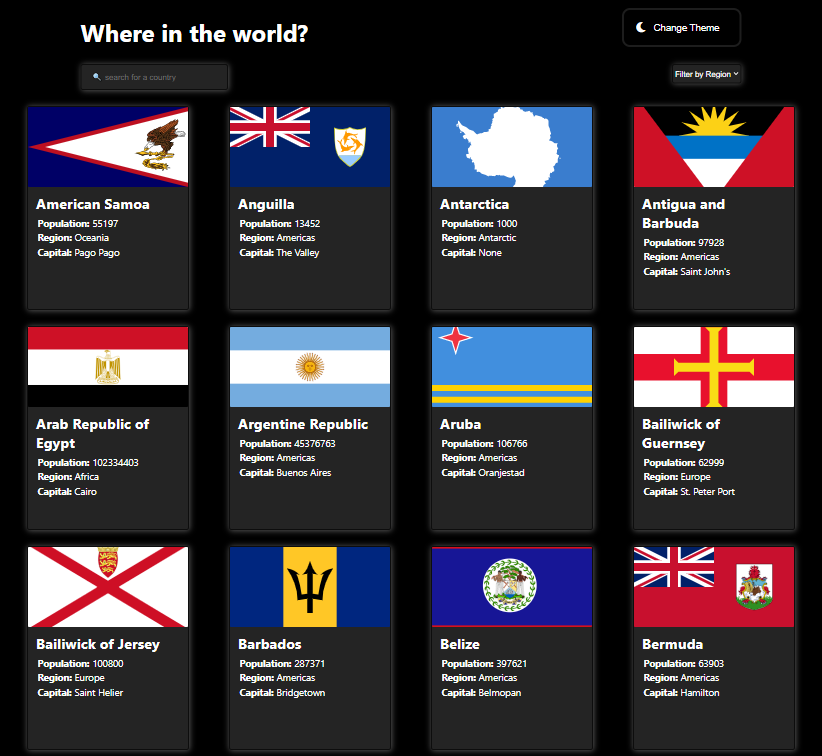

# Frontend Mentor - REST Countries API with color theme switcher solution

This is a solution to the [REST Countries API with color theme switcher challenge on Frontend Mentor](https://www.frontendmentor.io/challenges/rest-countries-api-with-color-theme-switcher-5cacc469fec04111f7b848ca). Frontend Mentor challenges help you improve your coding skills by building realistic projects.

I choose to make design modifications.(sorry front-end-mentor)

## Table of contents

- [Overview](#overview)
  - [The challenge](#the-challenge)
  - [Screenshot](#screenshot)
  - [Links](#links)
- [My process](#my-process)
  - [Built with](#built-with)
  - [What I learned](#what-i-learned)
  - [Useful resources](#useful-resources)
- [Author](#author)

## Overview

### The challenge

Users should be able to:

- See all countries from the API on the homepage
- Search for a country using an `input` field
- Filter countries by region
- Click on a country to see more detailed information on a separate page
- Click through to the border countries on the detail page
- Toggle the color scheme between light and dark mode _(optional)_ (done)

### Screenshot

### Links

- Solution URL: [Repository](https://github.com/LazezBZH/rest-countries-api)
- Live Site URL: [Deployment on Netlify](https://rest-countries-api-lazez.netlify.app/)

## My process

### Built with

- Semantic HTML5 markup
- CSS custom properties
- Flexbox
- [React](https://reactjs.org/) - JS library

### What I learned

I trained making API requests.
First time for me that I create an application with dark and light mode.

### Useful resources

- [Oneline Tutorials](https://www.youtube.com/c/OnlineTutorials4Designers) - a lot of nice css tricks, my loader is inspired of one.

## Author

- Website - [Bénédicte Hérault](https://lazez-bzh.netlify.app/)
- LinkedIn - [B. HÉRAULT](https://www.linkedin.com/in/benedicte-herault/)
